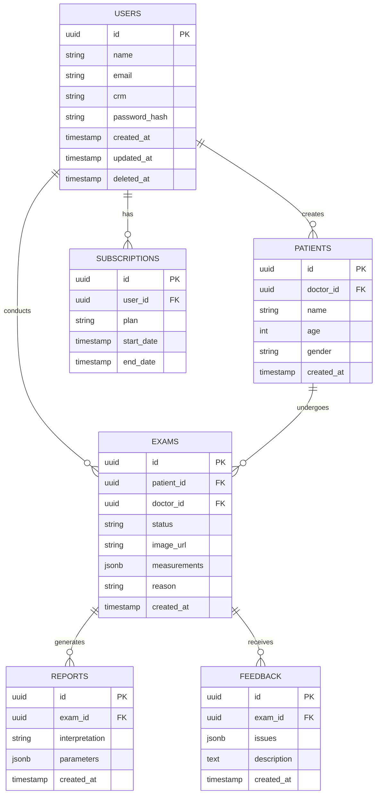

# Entity Relationship Diagram

```mermaid
erDiagram
    USERS {
        uuid id PK
        string name
        string email
        string crm
        string password_hash
        timestamp created_at
        timestamp updated_at
        timestamp deleted_at
    }

    PATIENTS {
        uuid id PK
        uuid doctor_id FK
        string name
        int age
        string gender
        timestamp created_at
    }

    EXAMS {
        uuid id PK
        uuid patient_id FK
        uuid doctor_id FK
        string status
        string image_url
        jsonb measurements
        string reason
        timestamp created_at
    }

    REPORTS {
        uuid id PK
        uuid exam_id FK
        string interpretation
        jsonb parameters
        timestamp created_at
    }

    FEEDBACK {
        uuid id PK
        uuid exam_id FK
        jsonb issues
        text description
        timestamp created_at
    }

    SUBSCRIPTIONS {
        uuid id PK
        uuid user_id FK
        string plan
        timestamp start_date
        timestamp end_date
    }

    USERS ||--o{ PATIENTS : "creates"
    USERS ||--o{ EXAMS : "conducts"
    PATIENTS ||--o{ EXAMS : "undergoes"
    EXAMS ||--o{ REPORTS : "generates"
    EXAMS ||--o{ FEEDBACK : "receives"
    USERS ||--o{ SUBSCRIPTIONS : "has"
```
